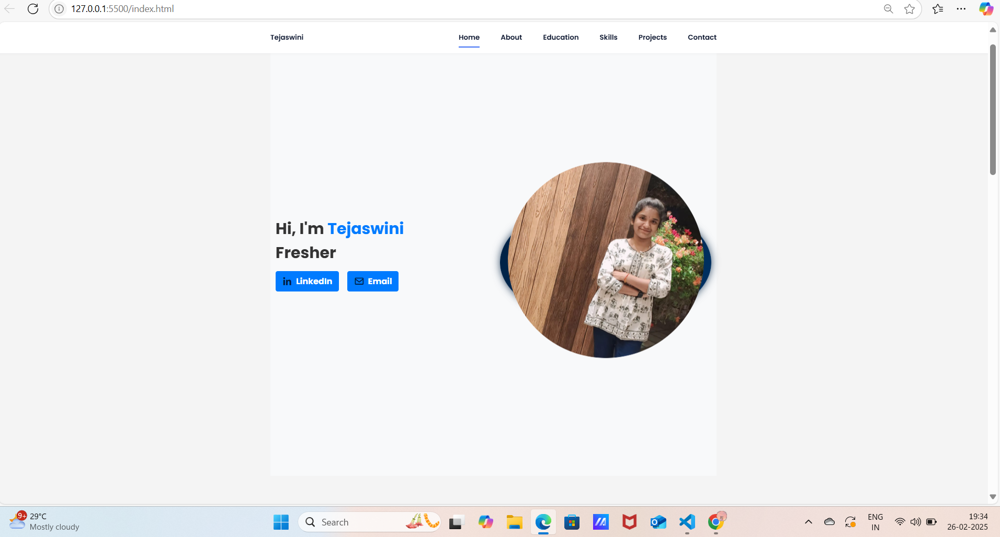
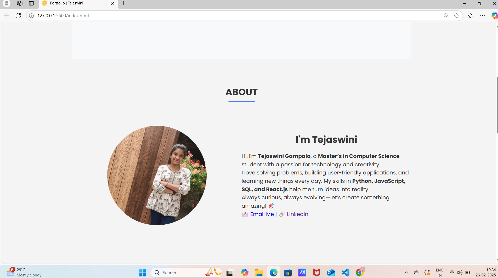
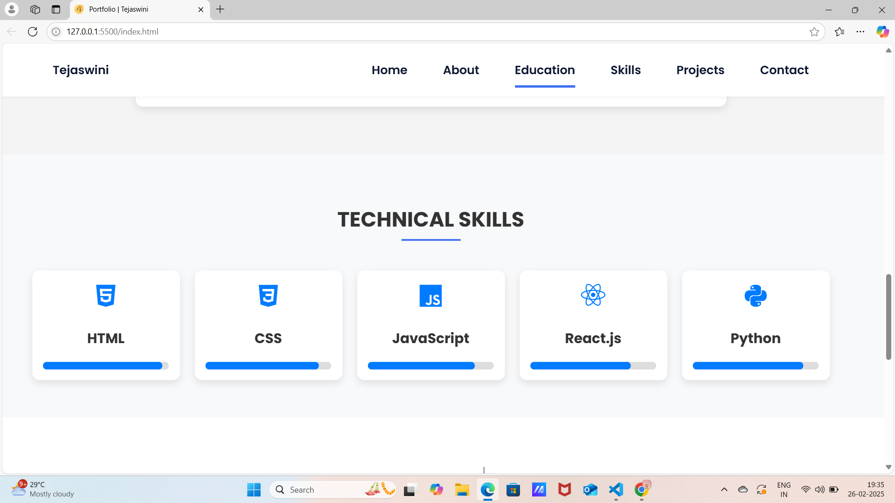
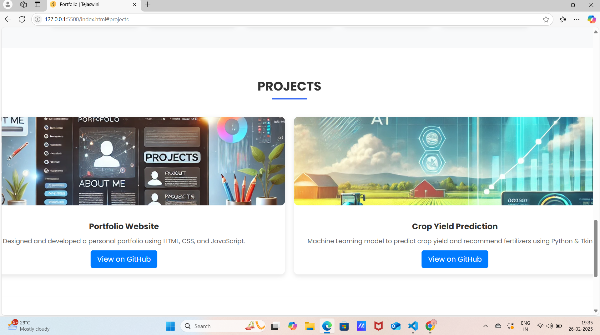

# 🌟 Tejaswini Gampala - Portfolio

Welcome to my personal portfolio website! This project showcases my skills, education, projects, and ways to connect with me.

## 📌 Live Demo
🔗 [View My Portfolio](https://tejaswigampala.github.io/)

---

## 📷 Screenshots

### 🏠 Home Page  

### 👩‍💼 About  

### 🎓 Education  

### 💡 Skills  

### 📂 Projects  

### 📞 Contact  

---

## 📖 About Me  
Hi, I'm **Tejaswini Gampala**, a **Master’s in Computer Science** student with a passion for technology and creativity.  
I specialize in **Python, JavaScript, SQL, and React.js**, and love solving problems & building user-friendly applications.

🔹 Always curious, always evolving—let’s create something amazing! 🎯

---

## 🎓 Education  
📍 **M.Sc Computer Science** | PB Siddhartha College, Vijayawada (2022 - 2024) | **87%**  
📍 **B.Sc Computer Science** | Surya Degree College, Jangareddygudem (2019 - 2022) | **85%**  
📍 **Intermediate (MPC)** | Surya Junior College, Jangareddygudem (2017 - 2019) | **80%**  
📍 **SSC (10th)** | Sri Saraswathi High School, Vegavaram (2017) | **80%**  

---

## 💻 Technical Skills  
✔ HTML, CSS, JavaScript  
✔ Python, PHP, SQL  
✔ Bootstrap, React.js  
✔ Figma, UI/UX Design  

---

## 🚀 Projects  

### 📌 [Portfolio Website](https://github.com/tejaswigampala)  
🔹 Designed a **personal portfolio** using HTML, CSS, JavaScript.

### 📌 [Crop Yield Prediction](https://github.com/tejaswigampala)  
🔹 ML model predicting **crop yield** & recommending fertilizers using Python.

---

## 📬 Get in Touch  
📩 **Email:** [tejaswi9392@gmail.com](mailto:tejaswi9392@gmail.com)  
🔗 **LinkedIn:** [linkedin.com/in/tejaswini-gampala-b95413263](https://www.linkedin.com/in/tejaswini-gampala-b95413263)  
🐙 **GitHub:** [github.com/tejaswigampala](https://github.com/tejaswigampala)  

---

📌 **Made with ❤️ by Tejaswini Gampala**  
